# 🚀 High-Concurrency Inventory & Order System

**Node.js · Express · Redis · MongoDB**

> **Diagram first. Code later.**
> This project shows how **real production systems** prevent overselling when many users buy at the same time.

---

## 🧭 System Flow (High Level)

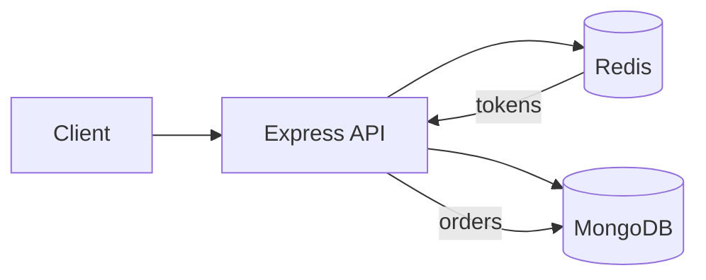

---

## 🔑 Core Rule (Very Important)

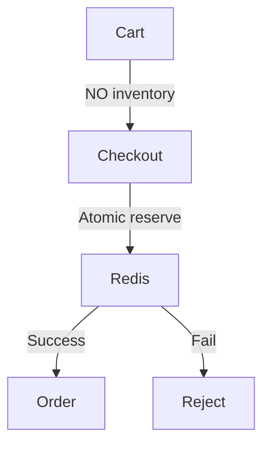

> **Inventory is touched ONLY at Checkout**

---

## 🧩 Main Entities

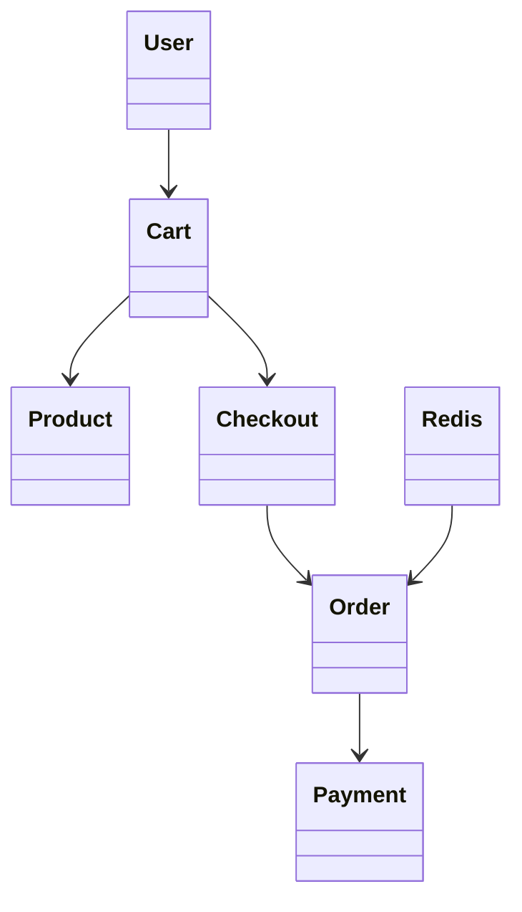

---

## 🧮 Inventory Model (Redis Tokens)

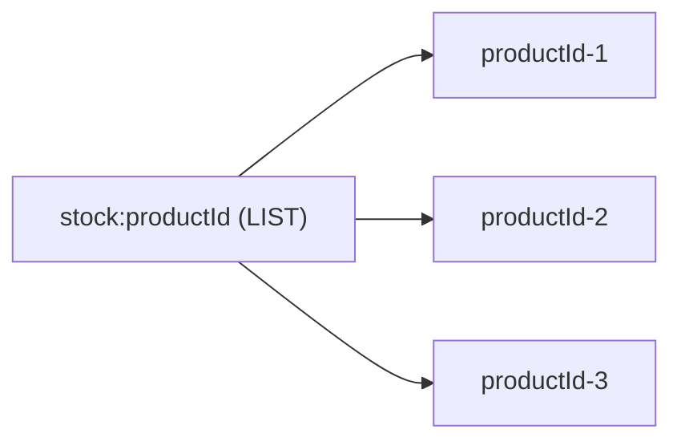

* 1 token = 1 unit of stock
* Redis = **source of truth**

---

## 🔥 Checkout (Atomic & Safe)

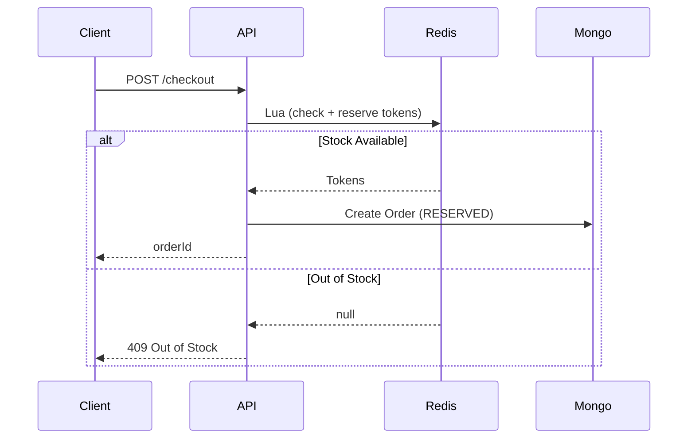
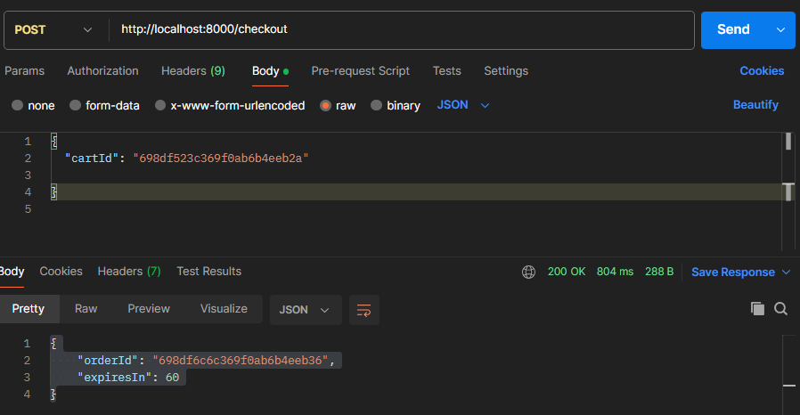
---

## 💳 Payment Flow

```mermaid
flowchart TB
    RESERVED -->|Payment Success| PAID
    RESERVED -->|Payment Fail| CANCELLED --> Revoke the Token
    RESERVED -->|TTL Expired| CANCELLED  --> Revoke the Token
```
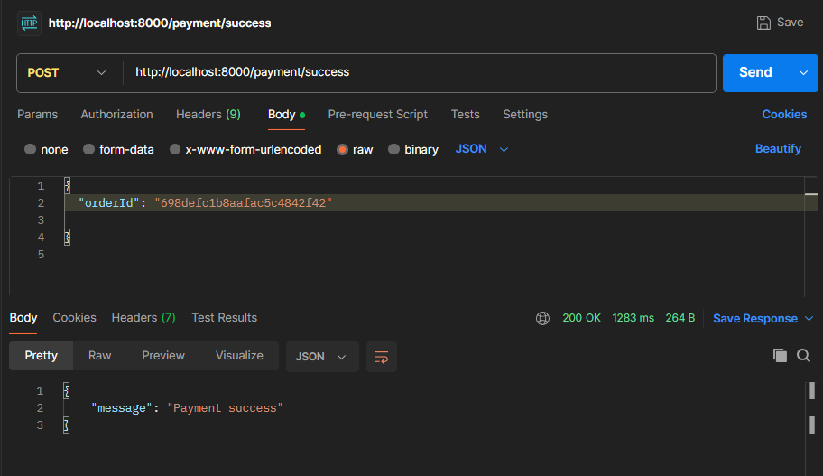
---

## ⏱️ Timeout & Token Revoke (Hybrid)

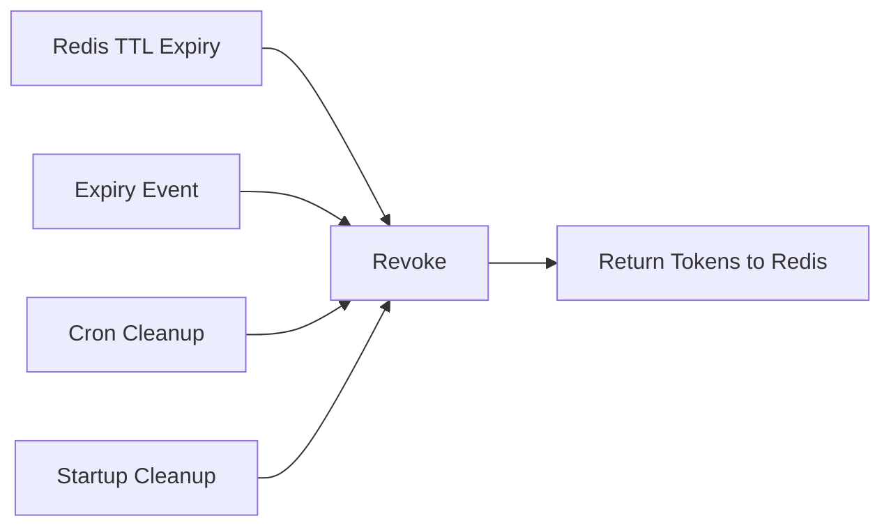

> **TTL is truth, events are optimization, cron is safety**

---

## 🛒 Full User Flow (End-to-End)

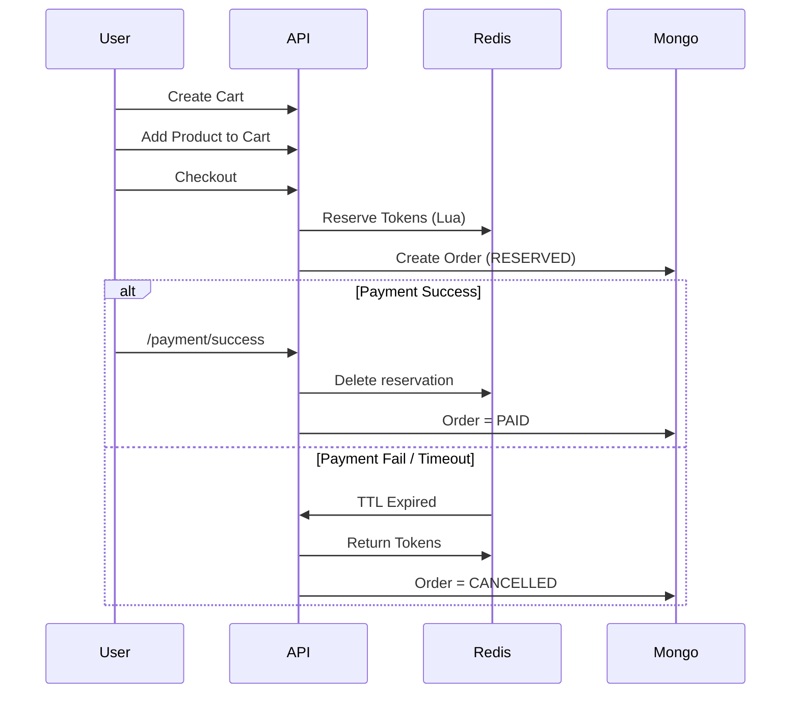

---

## 🧪 Debug / Observability

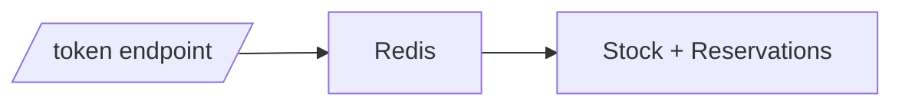

---

## 🚫 What This System Avoids

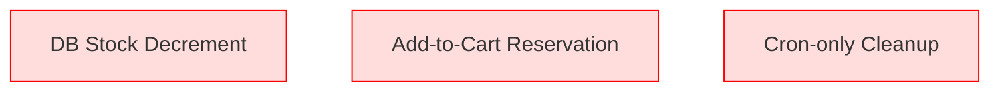
[High concurrency inventory system, Redis Lua atomic reservation, flash sale system design](https://nileshblog.tech/designing-a-high-concurrency-flash-sale-stock-inventory-reservation-system-with-node-js-redis-lua-and-mongodb/)
---

## 🏁 Final Mental Model

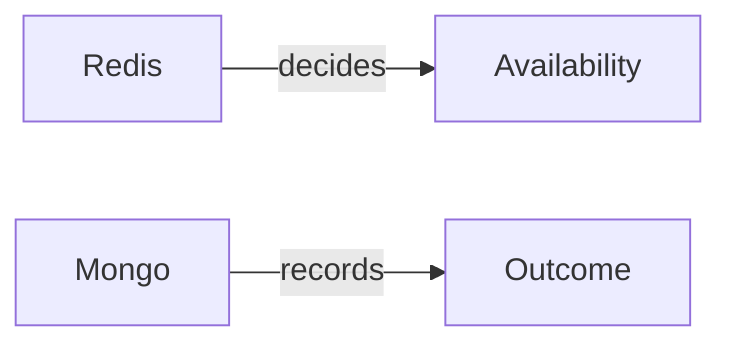

> **Redis decides who can buy.
> MongoDB records who bought.**

---

## 🛠️ Tech Stack

* Node.js + Express
* Redis + Lua
* MongoDB + Mongoose
* node-cron
* ioredis

---

## ⭐ Summary

* ✅ No overselling
* ✅ High concurrency safe
* ✅ Production-grade design
* ✅ Diagram-first explanation
